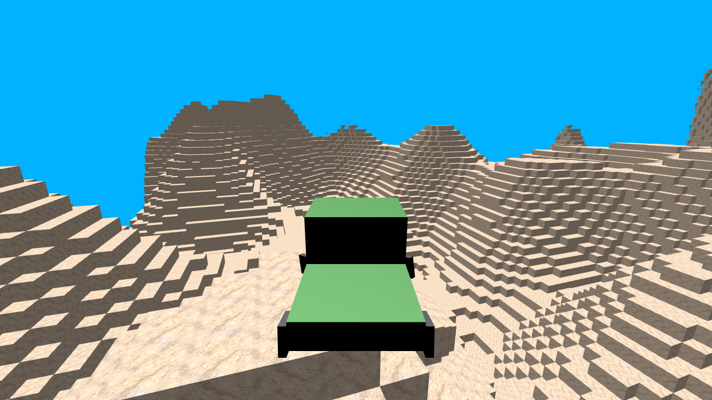
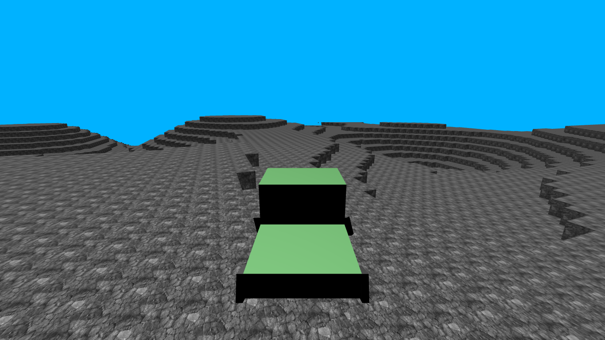

# Me, Cart

## How to use this project?

This project in made in C++ with OpenGL, some tools and libraries are needed to this program run correctly:
  - Clang
  - Make
  - GLFW
  - GLEW
  - GLM
  - STB

### Setting up

#### Fedora

```
sudo dnf install glew-devel glfw-devel glm-devel stb-devel clang make
```

#### Debian/Ubuntu

```
sudo apt install libstdc++-12-dev libglew-dev libglfw3-dev libglm-dev libstb-dev clang make
```

### Running

There are available 4 types of terrain in PGM are located at `resources/terrain/` that you can choose, or input your own PGM file.
There are available 2 types of terrain texture images are located at `resources/textures/` that you can choose, or input your own image file.

You need to build first with `make` that returns a binary `me-cart`:
```
make
./me-cart [terrain structure path] [terrain texture path]
```

If no files are specified the defaults are selected: `plains.pgm` and `limestone.jpg`.

## Actions

Use `Mouse` to move around, it's implements a fly-like camera:

| Key        | Description             |
| ---------- | ----------------------- |
| W          | Move forward            |
| S          | Move backward           |
| A          | Turn left               |
| D          | Turn right              |
| Escape     | Quit                    |

## Screenshots





## Textures Attributions

- `limestone.jpg` and `stone.jpg` by [kues1](https://www.freepik.com/free-photo/warm-limestone-texture_1035015.htm#query=stone%20texture&position=4&from_view=keyword&track=ais&uuid=ca5c40da-0b37-4d3b-a069-1f3b6a5be6a3) on Freepik

